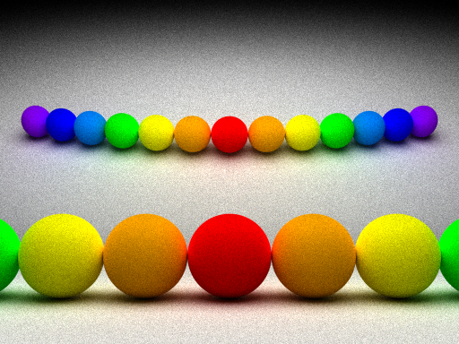

##Zebra: light-weight Monte Carlo Path Tracer
[中文版README](./README.md)

###Zebra is a light-weight Monte Carlo Path Tracer, it originates from [Giraffe](https://www.github.com/UncP/Giraffe)

***

###Goal
* Implement some of  [Giraffe](https://www.github.com/UncP/Giraffe)'s features in an accurate and elegant way
* Implement all kinds of algorithms that solve rendering equation 
* Be adjusted properly to cooperate with [Elephant](https://www.github.com/UncP/Elephant) to carry out some experiments between Computer Graphics and Maching Learning.

###If you are interested
`g++ -std=c++11 -O3 -fopenmp zebra.cpp -o Zebra`  
`./Zebra box 1 (1 means sample number, could be any positive number)`  
`./Zebra rainbow 4`  

###Implemented
* Pure Path Tracing
* Path Tracing with Direct Illumination
* Light Tracer

####Rainbow

####Cornell Box

