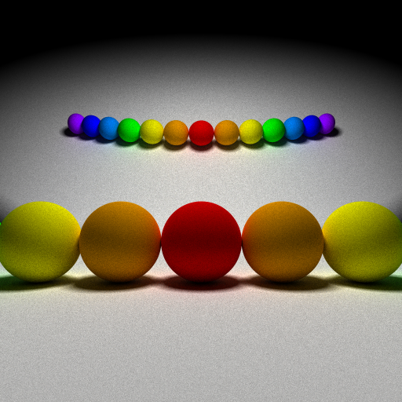
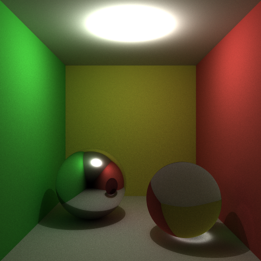

##Zebra: light-weight Monte Carlo Path Tracer
[中文版README](./README.md)

###Zebra is a light-weight Monte Carlo Path Tracer, it originates from [Giraffe](https://www.github.com/UncP/Giraffe)

***

###目标
* Implement some of  [Giraffe](https://www.github.com/UncP/Giraffe)'s features in an accurate and elegant way
* Try some advanced computer graphics techniques
* Be adjusted properly to cooperate with [Elephant](https://www.github.com/UncP/Elephant) to carry out some experiments between Computer Graphics and Maching Learning.

###If you are interested
`g++ -std=c++11 -fopenmp zebra.cpp -o Zebra`  
`./Zebra 4 (4 means sample number, could be any positive number)`  
`Zebra has its own tracing language, so you can change scene paramater in file scene.Zebra without re-compile`

####Rainbow

####Cornell_Box

